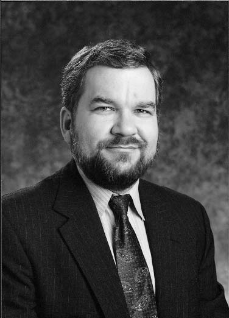

## 第六章 Pretty Good Privacy
隐私的政治，密码学的未来以及不可破译密码的追求

数字信息的交换已经成为了我们社会不可或缺的一部分。每一天，数千万封电子邮件被发送，因特网的存在为数字市场和繁荣的电子商务提供了基础。资金在网络空间流动，据估计，每一天世界上有一半的国内生产总值都是通过环球同业银行金融电讯协会（Society for Worldwide Interbank Financial Telecommunications, SWIFT）网络流转的。支持全民公投的民主国家开始采用在线投票，政府将会越来越频繁地使用因特网来管理国家，诸如提供在线报税服务。毫无疑问，我们处在信息时代，一个联网的世界。

信息时代的成功有赖于其保护在全世界流动信息的能力，而这取决于密码学的能力。密码为信息时代提供了钥匙和锁。两千年来，密码一直只被政府和军队所器重，而如今它也在促成商业交易起着作用，而在明日，普通人使用密码学将仅仅是保护自己的隐私。幸运的是，在信息时代腾飞之初，我们便拥有了强大的密码了。公钥密码学的发展——尤其是 RSA 密码——给予了今天的密码编码者在与密码破译者旷日持久的对抗中以明显的优势。如果 N 值足够大，Eve 将花费不可理喻的时间找到 p 和 q，因此 RSA 加密确实是坚不可摧的。最重要的是，公钥密码学不因任何密钥分发问题而被削弱。简言之，RSA 是保障我们珍贵信息牢不可破的锁。

**图 51** 菲尔·齐默尔曼

然而，密码与其他技术一样，有着其阴暗面。在保护守法公民通信的同时，密码也保护着罪犯和恐怖分子的通信。目前，警方使用电话搭线监听的方式收集有组织犯罪和恐怖主义的证据，并进行打击，但如果罪犯使用了不可破译的密码，电话监听将一无是处。

在二十一世纪，密码学的根本困境在于找到一种方式，它能够让公众和企业使用加密，享受信息时代的益处，而禁止罪犯滥用密码进而逃脱罪行。目前最激烈的争论是关于最佳解决方案的，其中大部分讨论是由菲尔·齐默尔曼（Phil Zimmermann）的事情引发的，他是一位倡导广泛使用强加密的美国密码学家，这吓坏了美国安全专家，威胁到腰缠万贯的国家安全局的有效工作，使他成为主要问询和大陪审团调查的对象。

20 世纪 80 年代末，齐默尔曼——这位长期政治活动家——开始将注意力转向数字革命和加密的必要性上：

> 密码学曾经是一门晦涩难懂的学科，与人们日常生活毫无联系。历史上，密码学一直在军事和外交通信领域有着重要地位。但在信息时代，密码学是一种政治力量，具体说，是关于政府和其人民的力量联系。它与隐私权，言论自由，结社自由，出版自由，免于不合理搜查与扣押以及独处自由有关。

齐默尔曼称，传统通信和数字通信有着本质区别，后者的安全意义更为重要：

> 在过去，政府若是想要侵犯普通公民的隐私，它必须付诸一定的努力，去拦截邮件，用蒸汽打开信封并阅读书面邮件，或者监听电话并尽可能地将谈话内容进行文字转录。这与用鱼钩鱼线捕鱼类似，一次只能一条鱼。对于自由和民主来说幸运的是，这类劳动密集型监控在大尺度上并不适用。如今电子邮件逐步取代了传统书面信件，进入寻常百姓家，不再是新鲜事物。和书面信件不同，拦截电子邮件并扫描感兴趣的关键词简直是小儿科。它可以在大尺度上轻松、例行、自动化和悄无声息地完成。它与渔网捕鱼相似——在民主健康的量与质上有着奥威尔式的区别。

普通和电子邮件的区别可以通过想象以下场景阐明：Alice 想要发送她的生日派对邀请函，而没有被邀请的 Eve 想要知道何时何地举办派对。如果 Alice 使用传统方式投递信件，那么对于 Eve 来说拦截邀请函是非常困难的。首先，Eve 不知道 Alice 的邀请函是何处进入邮件系统的，因为 Alice 可以使用城市里的任意邮桶。想要截获邀请函，她只能寄希望于通过某种方式确定 Alice 朋友的住址，并潜入当地分拣办公室。接下来她得手工检查每封邮件。要是她设法找出了 Alice 的信件，她必须使用蒸汽打开它，查看她想要的信息。她还要依原样复原，以避免任何篡改的怀疑。

作为对比，如果 Alice 用电子邮件发送邀请函，Eve 的任务就相当容易了。在消息离开 Alice 计算机后，它们便前往本地服务器，一个因特网的主要进入点；如果 Eve 足够聪明，她无需离开家便可入侵本地服务器。邀请函会带有 Alice 电子邮箱地址，设置一个含有 Alice 地址的电子过滤器就行了。由于找到的邀请函上没有信封，可以直接阅读了。此外，邀请函不会显示任何在途中被拦截的迹象。Alice 一举一动都变的明显。然而，有一种方法可以阻止 Eve 阅读 Alice 电子邮件——那就是加密。

每一天世界上大多数已发送的电子邮件都是容易受到拦截的，因为多数人不进行加密。齐默尔曼说，密码学家有责任鼓励人们使用加密，从而保护个体的隐私：

> 未来的政府可能会拥有一个专门为监控优化的技术设施，通过它，政府可以观察政治异议的运动，每一笔金融交易，每一次通讯，电子邮件的每一比特，每一支通话。万物皆可过滤和扫描，并用语音识别技术进行识别和文字转录。现在是时候让密码学走出特工和军队的阴影，与阳光中的我们拥抱了。

1977 年 RSA 被发明时，它为老大哥场景提供了理论上的解毒剂，因为个人可以自行生成公钥和私钥，收发完全安全的消息了。但是在实际操作过程中存在一个大问题——RSA 加密过程需要大量计算资源。在 80 年代，只有政府，军队和大型企业才拥有足够强大的计算机来运行 RSA 密码系统。毫不奇怪，RSA Data Security, Inc. 这家商业化运作 RSA 的公司，只考虑为这些市场开发其密码产品。

而齐默尔曼认为每个人都应该得到由 RSA 密码提供的隐私，它致力为大众开发一款 RSA 密码产品。他打算凭借自己的计算机科学背景，设计出一款他认为经济高效的产品，而不超出个人计算机的能力。他也想让他的 RSA 版本有着特别友好的界面，用户无需成为密码学专家即可使用它。他把项目称之为 Pretty Good Privacy， 缩写 PGP。这个名字的灵感来自 Ralph 的 Pretty Good Groceries，是齐默尔曼最喜爱电台节目《牧场之家好作伴》（Garrison Keillor’s A Prairie Home Companion）的赞助商。

在 80 年代晚期，齐默尔曼在科罗拉多州博尔德的家中逐步将它打成软件包。他的主要目标是加快 RSA 加密的速度。原先 Alice 想要使用 RSA 加密给 Bob 的消息，她需要查找他的公钥，对消息使用 RSA 单向函数。反过来，Bob 使用他的私钥执行 RSA 单向函数逆过程得以解密密文。这两个过程需要大量的数学运算，如果消息足够长，加密和解密可以在个人计算机上持续数分钟之久。如果 Alice 每天发送一百条消息，她将难以忍受每条消息加密的时间。为了加快加密和解密的过程，齐默尔曼使用了一个巧妙的技巧，他将 RSA 非对称加密和传统对称加密结合使用。传统对称加密可以和非对称加密一样安全，而且它性能更佳，但对称加密存在密钥分发问题；密钥必须从发送者安全地传输到接收者。这便是 RSA 用武之地，RSA 能够用来加密对称密钥。

齐默尔曼描述了以下场景。如果 Alice 想要给 Bob 发送加密消息，她先使用对称密码加密消息。齐默尔曼建议使用被称为 IDEA 的对称密码。要使用  IDEA 加密，Alice 需要取密钥，但 Alice 必须通过某种方式把密钥给 Bob，Bob才得以解密消息。Alice 通过查找 Bob 的 RSA 公钥，并用它加密 IDEA 密钥，克服这一难题。此时 Alice 给 Bob 发送了两件东西：用 IDEA对称密码加密的消息和用 RSA 非对称密码加密的 IDEA 密钥。在另一头，Bob 使用他的 RSA 私钥解密得到 IDEA 密钥，接着用 IDEA 密钥解密消息。这么做似乎有些迂回， 其优势在于，所包含大部分信息被更快速的对称密码加密，而相对较少的信息——只有 IDEA 密钥——被更慢的非对称密码加密。齐默尔曼计划将 RSA 和 IDEA 整合进 PGP 产品，而用户友好界面意味着用户不必知晓正在发生的细枝末节。

1991 年夏，齐默尔曼正将 PGP 打磨成完善的产品，剩下的唯一问题是：美国参议院 1991 年综合反犯罪法案（U.S. Senate’s 1991 omnibus anticrime bill），它包含以下条款：“国会的意见是，电子通信服务提供商和电子通信服务设备制造商应当确保允许政府在经过适当的法律授权情况下获取语音、数据以及其他通信的明文内容。”参议院担心像蜂窝电话的数字技术的发展可能会阻碍执法者进行有效的电话监听。然而除了强迫公司保证电话监听的可行性，该法案似乎也威胁了所有安全加密的形式。

在 RSA Data Security，通信业和公民自由组织的共同努力下，该条款被迫废除，但达成的共识只不过是临时缓刑令。齐默尔曼担心政府会迟早再度立法禁止诸如 PGP 这类加密。他一直想销售 PGP，但现在他重新考虑了他的选项。他决定不再等待 PGP 是否会被政府禁止，重要的是，他要在事情无法挽回前让所有人都能够使用它。1991 年 6 月，他激进地要求一位朋友将 PGP 发布在 Usenet 公告板上。PGP 只是一款软件，任何人都可以在公告版上免费下载它。现在 PGP 犹如因特网上的一匹脱缰野马。

起初 PGP 只在密码学爱好者圈子里引起了骚动，后来它被大量因特网爱好者下载。接着计算机杂志刊登了它的短篇报道，之后是整版关于 PGP 现象的文章。PGP 进入了数字社会最偏僻的角落，比如全世界的人权组织开始使用 PGP 加密他们的文件，以避免信息落入被指控人权侵犯的政权手中。齐默尔曼开始收到一些赞扬其发明的邮件。“有几个缅甸的抵抗组织，”齐默尔曼说，“他们把 PGP 用于丛林训练营，说这鼓舞了士气，因为在 PGP 使用前，被截获的文件会导致逮捕、严刑拷打，甚至株连九族。”1991 年，鲍里斯·叶利钦炮击莫斯科议会大厦那天，齐默尔曼收到由拉脱维亚某人中转的邮件：“菲尔，我希望你知道：如果独裁政权统治了俄罗斯（希望永远不会发生），你的 PGP 已经在波罗的海到远东广为人知，并在必要时帮助民主人士。谢谢。”

当齐默尔曼享誉全球时，在他美国的家乡却遭到冷落。1993 年 2 月，两名政府调查员造访了齐默尔曼，原因是美国政府将加密软件囊括在军火的定义中，和导弹、迫击炮、机关枪一样。没有国务院的许可，PGP 不准出口。换言之，齐默尔曼被指控为一名军火商，因为他通过因特网将 PGP 出口了。在接下来三年多时间里，齐默尔曼成为了大陪审团调查的对象，并遭到政府官员的纠缠。对齐默尔曼和 PGP 的调查引发了在信息时代有关加密的积极和消极影响的辩论。PGP 的传播促使密码学家、政客、公民自由主义者和执法者重新思考广泛使用加密的意义。像齐默尔曼一样的人相信安全加密的广泛使用给社会带来福音，为个体提供数字通讯的隐私。反对阵营则认为加密对社会造成威胁，因为犯罪分子和恐怖分子将有能力在警方搭线监听下秘密和安全地通信。

执法者认为有效的监听是维护法令的必要条件，加密应当加以限制，这样他们可以继续监听。警方已经遇到使用强加密保护自身的犯罪分子了。一位德国法律专家说，“像武器和毒品这样的热门交易不再通过电话完成，而是通过全球数据网络进行加密形式的结算。”一位白宫官员表达了在美国相似的担忧趋势，“有组织犯罪成员是一些计算机系统和使用强加密的高级用户。”比如，卡利集团（Cali cartel）通过加密通信安排毒品交易。执法者担心，因特网和密码学的结合将帮助犯罪分子进行沟通和协调。

除了使用加密通讯，犯罪分子和恐怖分子也将计划和记录加密，从而阻止恢复证据。为 1995 年东京地铁毒气攻击事件负责的奥姆真理教（Aum Shinrikyo sect）被发现使用 RSA 加密了部分文件。拉姆齐·优素福（Ramsey Yousef），1993 年世贸中心爆炸案涉嫌的恐怖分子之一，将未来的恐怖主义行动计划加密保存在他的便携式电脑中。除了国际性恐怖组织，未受训练的犯罪分子也从加密中受益。例如，一个美国赌博集团加密其账户有四年之久。1997 年国家战略信息中心美国有组织犯罪问题工作组（National Strategy Information Center’s U.S. Working Group on Organized Crime）委托多萝西·丹宁（Dorothy Denning）和威廉·鲍（William Baugh）的研究估计全球有五百宗刑事案件涉及加密，并预测这一数字将大约每年翻一番。

除了国内治安外，还有国家安全问题。美国的国家安全局（National Security Agency）的职责是通过解密敌对国家通讯来收集情报。国家安全局还运作着一个全球性监听站网络，它与英国、澳大利亚、加拿大和新西兰合作，彼此收集和共享信息。这一网络有约克夏郡的门维斯山信号情报基地（Menwith Hill Signals Intelligence Base），它是世界上最大的间谍站。门维斯山涉及了“梯队”系统（Echelon system）的部分工作，它有能力扫描电子邮件、传真、电传和电话呼叫，搜索其特定的单词。“梯队”根据一个可疑词汇的词典进行运作，这些词汇诸如真主党、刺客和五角大楼，这个系统足够智能，它可以实时识别出这些词汇。“梯队”可以对可疑消息打上标记，以供进一步筛查，使用它监视特定政治组织和恐怖集团的消息。然而，如果所有消息都经过强加密，那么“梯队”将一无是处。每个参与“梯队”的国家将损失有关政治阴谋和恐怖攻击的宝贵情报。

争论的另一方是公民自由主义者，包括像民主与技术中心（Center for Democracy and Technology）和电子前哨基金会（Electronic Frontier Foundation）这样的组织。支持加密的理由基于以下信念——隐私是一项基本人权，正如《世界人权宣言》（Universal Declaration of Human Rights）第 12 条所承认的那样：“任何人的私生活、家庭、住宅和通信不得任意干涉，他的荣誉和名誉不得加以攻击。人人有权享受法律保护，以免受这种干涉或攻击。”

公民自由主义者认为广泛使用加密是隐私的必要保证。他们担心高级监视技术的诞生将开启监听的新时代，带来不可避免的滥用监听行为。在过去，世界各国政府频频使用他们的权利对无辜公民进行监听。

最臭名昭著的一个例子是对小马丁·路德·金（Martin Luther King Jr.）持续的不公正监听，他的电话对话被监听了数年之久。例如，1963 年联邦情报局（FBI）通过监听获得了金的信息，并提供给参议员詹姆斯·伊斯特兰（James Eastland），帮助他在民权法案问题的辩论。更普遍的是，FBI 收集了金的私生活细节，令其毁誉。金讲黄色故事的录音被寄给其妻子，并在约翰逊总统（President Johnson）前播放。在金获得诺贝尔奖之后，有关金生活的尴尬细节被发给任何考虑授予他荣誉的组织。

或许对所有人隐私最大程度侵犯的就是国际性“梯队”项目。“梯队”不必证明其拦截的正当性，而不关注特定的个人。相反，它不加区分地收集信息，使用接收器检测经过卫星的远程通信。如果 Alice 向 Bob 发送一条无害的跨大西洋消息，那么它必定将被“梯队”截获，如果消息正好有“梯队”词典中的一些词汇，那么它被打上标记，供进一步检查，消息涵盖极端政治组织到恐怖帮派。执法者认为加密应该禁止，因为它会使“梯队”失效，而公民自由主义者则认为正是因为加密能使“梯队”失效，所以它是必要的。

RSA 发明者之一 Ron Rivest 认为限制密码学是鲁莽的：

> 如果只是因为某些犯罪可能会利用其优势而不分青红肥白地取缔某一技术，那么这种政策是愚蠢的。比如，任一美国公民可以自由地购买一双手套，即使窃贼可能会用他们不留指纹地洗劫房屋。密码学是一种数据保护技术，就像手套是一种护手技术。密码学可以阻止黑客、商业间谍和骗子的侵害，而手套则保护人们割伤、刮伤，御热、御寒和防止感染。前者可以挫败 FBI 监听，后者可以阻止 FBI 的指纹分析。密码和手套都是广泛使用的廉价物品。事实上，你可以以不到一双上好手套的价格下载到优秀的密码学软件。

大型企业可能是公民自由主义者的最大盟友。因特网商务仍处在起步阶段，但销售额在快速增长，书籍、音乐 CD、计算机软件零售商处于其领先地位，超市、旅游公司和其他商业公司紧随其后。今后的几年里，因特网商务将会主宰市场，但前提是企业能解决安全和信任问题。企业必须保障金融交易的隐私和安全，而使用强加密是做到这一点的唯一方法。

此刻，因特网上的购买行为能够受到公钥密码学的保护了。Alice 访问了某家公司网站并挑选了商品。她在订单单表中填写了姓名、地址和信用卡信息。Alice 接着使用公司的公钥加密了订单单表，公司是能解密它的唯一实体，因为只有公司有用于解密消息必要的私钥。这一切都是由 Alice 的浏览器（如 Netscape 或 Explorer）与公司的计算机自动完成。

企业希望强加密也另有其因。企业储存了大量信息在计算机数据库中，它们包括产品描述、客户信息和企业账户。企业自然想保护这些信息，免受可能想渗透计算机和窃取信息的黑客的侵害。这种保护可以通过加密储存信息做到，所以即使有人入侵了数据库，他也无法读取它。

综上，很明显争论由两大阵营主导：支持强加密的公民自由主义者和企业，反方则是支持严格限制密码学的执法者。而最近出现了第三种选项，它可能提供了一种折中方案。过去的十多年里，密码学家和政策制定者在调查一种被称为“密钥托管”（*key escrow*）方案的优缺点。术语“托管”通常是一种约定，某人将一笔钱给第三方，而第三方在符合特定条件下将钱交给乙方。举例说，租客向律师交纳押金，律师在财产受损的情况下将其交给房东。在密码学术语中，托管意味着 Alice 将其私钥的副本交给托管代理——一位独立且可靠的中间人，只要有足够的证据暗示 Alice 涉及犯罪，他便可以将私钥交给警方。

最著名的密码学密钥托管实验是《美国托管加密标准》（American Escrowed Encryption Standard），于 1994 年采用。该法案旨在鼓励采用两种加密系统——*clipper* 和 *capstone*——分别用于电话和计算机通讯。要使用芯片加密，Alice 需要购买一部预安装芯片的电话，芯片保存着私密的私钥信息。就在她购买 clipper 电话的那一刻，芯片中的私钥副本将被分成两部分，每一部分将被发送至两个分离的联邦部门进行储存。美国政府认为 Alice 有权进行安全加密；只有在执法者能够说服两个联邦部门她符合获取其私钥条件时，她的隐私才受到损害。

美国政府在其内部通讯时已经使用了 clipper 和 capstone，并规定涉及政府业务的公司必须采用《美国托管加密标准》。其他企业和个人可以自由地使用其他形式的加密，但政府希望 clipper 和 capstone 会逐步成为全国性支持的加密形式。然而，政策并未发生效用。密钥托管的想法只在政府外赢得了少数几个支持者。公民自由主义者并不喜欢联邦政府拥有每个人密钥的想法——他们拿真实钥匙做比较，如果政府拥有所有人房屋的钥匙，人们该作何想法。密码学专家指出，只要一名不正直的雇员将托管密钥卖给出最高价者，就会破坏整个系统。而企业担心其机密性。比如，某家在美国的欧洲企业可能会害怕其消息被美国贸易官员截获，后者企图获取能给美国竞争者带来竞争优势的商业秘密。

即使美国政府已经撤回了其密钥托管提案，但许多怀疑者认为它会在未来某个时候以密钥托管的其他形式，带其卷土重来。在经历可选性托管失败之后，政府甚至可能考虑强制性托管。同时，亲密码团体继续游说反对密钥托管。技术记者肯尼斯·尼尔·库基尔（Kenneth Neil Cukier）写道：“参与密码辩论的人都是些聪明、诚实和支持托管的人，但他们不可能同时具备两种以上这些品质。”

要想平衡公民自由主义者、企业和执法者，政府的选择还有许多。哪种会成为首选还尚未明了，此刻的密码学政策处于不断变化的状态。当你在阅读本文时，关于密码学政策的争论就已经反转了许多次。

没有人能预测今后十年里密码学政策的准确外貌。我个人认为，在不久的将来，亲密码团体会初步赢得胜利，主要原因在于没有国家想要一部禁止电子商务的密码法。如果该政策被证明是错误的，其后果不一定是长期灾难，推翻法律总是可能的。如果执法者能够证明监听可以阻止恐怖分子暴行，那么政府将迅速获得对密钥托管政策的支持。所有使用强加密的用户将被迫把其密钥储存在密钥代理商中，此后任何使用未托管密钥发送消息的人将会违反法律。如果对非托管加密的惩罚足够严重，执法者将重占上风。接着，如果政府滥用与密钥托管系统的信任，公众则要求恢复密码自由，时钟将倒走。简言之，没有理由不修改政策以适应政治、经济和社会气候的变化。决定性因素将会是公众更惧怕谁——是罪犯还是政府。

### 密码学的未来

1996 年，在经过三年的调查后，美国司法部长办公室（U.S. attorney general’s office）放弃了对齐默尔曼一案的起诉。当局意识到它已为时已晚——PGP 已逃入因特网，起诉齐默尔曼对此于事无补。此外还有一个问题，各大学院支持着齐默尔曼，比如麻省理工学院出版社将 PGP 发表在 600 页的书中。这本书在世界各地发行，因此起诉齐默尔曼将意味着起诉麻省理工学院出版社。齐默尔曼有可能不被定罪，政府也不热衷于起诉——审判带来的恐怕不过是一场有关隐私权的尴尬宪法辩论，从而激起公众对广泛使用加密的认同。

最终，PGP 成为了合法的产品，齐默尔曼也恢复了自由身。这次调查使得他成为密码学运动的领袖。世界上任何一位营销主管势必会羡慕齐默尔曼一案带给 PGP 的名声和免费宣传。1997 年底，齐默尔曼将 PGP 卖给了 Network Associates，而他成为了他们的资深伙伴。即便现在 PGP 卖给了商业公司，如果不用作商业用途，个人仍然可以免费使用。换言之，仅仅希望实践自己隐私权的人仍然可以下载 PGP，而无需为此付费。

你要是想获得 PGP 的副本，有许多因特网网站提供它的下载，你应当相当容易能够找到。其中最可靠的大概是 PGP 国际主页 [www.pgpi.com/](http://www.pgpi.com/)，在上面你可以下载到美国版和国际版 PGP。这一点上，我不想做任何担保——如果你想选择安装 PGP，你得自己检查你的计算机能够运行它，软件未被病毒感染等等。此外，你应当检查你所在的国家是否允许使用强加密。

时至今日，公钥密码学的发明以及使用强密码的政治争论仍萦绕耳畔。很明显，密码编码者（cryptographers）赢得了这场信息战。齐默尔曼说，我们处在密码学的黄金时期：“在现代密码学中，发明远远超出密码分析（cryptanalysis）所有已知形式的密码是可行的。我认为这种情况将一直持续下去。”国家安全局副局长威廉·克罗威尔（William Crowell）赞同齐默尔曼的观点：“如果世界上所有的个人计算机加在一起——大概有 2.6 亿台计算机——破译一条由 PGP 加密的消息，这需要花费 1200 万倍于宇宙年龄的时间。”

然而先前的经验告诉我们，每一种被称为不可破译的密码迟早会屈服于密码分析。维热纳尔密码（Vigenère cipher）被称为不可破译的密码，但巴比奇（Babbage）破译了它；Enigma 被认为是毫无漏洞的，但波兰人发现了它的弱点。所以，是密码分析师（cryptanalysts）正迎来下一次的突破，还是齐默尔曼是对的？预测任何技术的发展总是充满风险的，密码学尤其如此。我们不但要预测将来会发现什么，而且还要猜测目前已经发现什么。詹姆斯·埃利斯（James Ellis）和 GCHQ 的故事警示着我们，一些重大突破可能就隐藏在政府情报部门之后。

但如果 RSA 被破译了，安全加密的希望已经存在。1984年，位于纽约的 IBM 托马斯·J·沃森实验室（IBM’s Thomas J. Watson Laboratories）研究员查尔斯·贝内特（Charles Bennett）提出了量子密码学（quantum cryptography）的想法。量子密码学是完全无法破译的密码系统，它是基于量子物理学（quantum physics），后者是解释宇宙在最基本层面运作方式的理论。贝内特的想法在量子物理学中属于被称为海森堡不确定性原理（Heisenberg’s uncertainty principle）的层面，该定律说不可能以极高的精度测量某个物体，因为测量行为本身会改变被测量的物体。

举例说，我要测量手的长度，首先我得看到它，因此我必须有光源（无论是日光还是灯光）。光波会先抵达手，然后反射到眼睛，但这有两个问题。其一，光的波长限制了任何尺度测量的精度。其二，光波对我的手的影响会返过来改变光波本身，就像海波拍打着峭壁一样。与海波相比，光波的影响微乎其微，在日常生活中无法被感知。因此工程师试图高精度地对螺栓进行测量，而测量仪器的质量远远早于他进行实验时就被不确定性原理所限制了。然而，在微观层面上不确定性原理是个大问题。在质子和电子的尺度，测量的不精确会相当于被测量物体的大小。光的影响会显著改变被观测的细小的粒子。

贝内特提出使用基本粒子发送信息的想法，如果 Eve 尝试截获或测量粒子，她会错误测量并改变它们。简言之，Eve 不可能精确地截获通信，甚至她尝试做了，她的影响对于 Alice 和 Bob 来说很明显，他们会知道她在监听并中断通信。

你可能会问：Alice 给 Bob 发送了一条量子密码学消息，根据不确定性原理 Eve 无法阅读它，那 Bob 怎么阅读它？他为什么不受到不确定性原理的影响？解决方案是 Bob 需要发送一条密文用于确认他收到的内容，因为 Alice 知道她发给 Bob 的原始内容，第二封消息用于删除 Alice 和 Bob 之间的错误部分，而把 Eve 留在阴暗中。在两次沟通结束后，Alice 和 Bob 便可以愉快地进行完全安全的通信了。

**图 52** 查尔斯·贝内特

量子密码学的整个想法听起来很荒谬，但 1988 年贝内特成功证明了在两台距离 12 英寸计算机之间安全通信的可行性。长距离消息仍有困难，因为消息是由单个粒子传递的，远距离传输可能会破坏它们。因此在贝内特实验之后，挑战便是在实用距离上建立可运行的量子密码学系统。1995 年，瑞士日内瓦大学（University of Geneva）的研究人员成功实现从日内瓦到尼翁（Nyon）的量子密码学通信，距离 14 英里有余。

现在，安全专家想知道量子密码学成为实用技术还需要多久。此时此刻，使用量子密码学并没有太大优势，RSA 密码已经给予我们足够不可破译的加密了。但如果密码破译者发现 RSA 的漏洞，那么量子密码学就变得必要。因此比赛还在继续。瑞士的实验已经证明了，在城市里的金融机构之间建立安全通信的可行性。它确实可以在白宫和五角大楼之间建立量子密码链路（quantum cryptography link），它很可能已经存在了。

量子密码学将标志着密码编码者（codemakers）和密码破译者（codebreakers）战争的结束，密码编码者胜出，因为量子密码学是真正不可破译的密码系统。根据前面类似的说法，这似乎是一个言不副实的断言。在过去两千年里的不同时期，密码编码者相信单字母密码（monoalphabetic cipher），多表密码（polyalphabetic cipher）以及像 Enigma 的机器密码都是不可破译的。在这些例子中的密码编码者最终被证明是错的，因为他们断言是建立在密码复杂性的基础之上，而非同时期密码分析师的才智和技术。我们已经看到了，密码分析师不可避免地对这些密码各个击破，开发出新技术破解它们。

然而，对量子密码学的断言是安全的，它与先前的断言截然不同。量子密码学不仅是不可破译，而且绝对不可破译。量子论是物理学史上最成功的理论，它意味着 Eve 不能精确地拦截 Alice 和 Bob 之间的任何通信。Eve 无法做到 Alice 和 Bob 不被警告的情况下，尝试拦截任何通信，如果可以，这将证明量子论是存在漏洞的。这对物理学家来说是一场灾难——他们将被迫重新思考他们对宇宙在最基本层面运作方式的理解。

如果量子密码学能够实现长距离运作，那么密码的演化便会停止。对隐私的追求也到了尽头。这项技术将会被用于保证政府、军队、商业以及公众的安全通信。剩下的唯一问题是，政府是否会允许我们使用这项技术了。
